# 🧠 Awesome LLM Papers

<div align="center">


[](https://awesome.re)
[](https://github.com/puneet-chandna/awesome-LLM-papers/stargazers)

[](CONTRIBUTING.md)

<h3>Read what matters. Skip the noise. 🎯</h3>

<p align="center">
  <a href="#-todays-pick">Today's Pick</a> •
  <a href="#-this-weeks-essential-reads">This Week</a> •
  <a href="#-must-read-papers-hall-of-fame">Hall of Fame</a> •
  <a href="#-browse-by-category">Categories</a> •
  <a href="#-research-trends-dashboard">Research Trends</a> •
  <a href="#-contributing">Contribute</a>
</p>

---


<!--  -->

</div>

---

## 🔥 Today's Pick

### 🏆 **[Titans: Learning to Memorize at Test Time](summaries/Titans%20Learning%20to%20Memorize%20at%20Test%20Time.md)**

<table>
<tr>
<td width="70%">

**Authors:** _Behrooz Ghorbani, Ali Behrouz, Amir Zandieh, Amin Karbasi, Vahab Mirrokni, Mehrdad Farajtabar_ • Google Research

**Why this matters:** This groundbreaking paper introduces a new architecture that combines the power of Transformers with learnable memory modules, enabling models to memorize and recall information at test time. Titans achieve superior performance on long-context tasks while maintaining efficiency.

**Key Innovations:**

- 🔸 Neural long-term memory module that learns to memorize at test time
- 🔸 Three architectural variants: Memory as Context (MAC), Memory as Gate (MAG), and Memory as Layer (MAL)
- 🔸 Outperforms Transformers and modern linear recurrent models on language modeling, commonsense reasoning, and needle-in-haystack tasks
- 🔸 Scales effectively to context windows over 2M tokens with persistent memory

</td>
<td width="30%">

**Resources:**

- 🔗 [**Paper**](https://arxiv.org/pdf/2501.00663)
- 📊 [**Google Research**](https://research.google/)
- 🐦 [**Thread**](https://x.com/behrouz_ali/status/1878859086227255347?s=20)

**Impact Score:**

```diff
+ Performance: █████████░ 94%
+ Innovation:  ██████████ 96%
+ Practicality:█████████░ 90%
```

</td>
</tr>
</table>

---

## 🔥 Trending Topics

_"Hot research areas this month - Where the field is moving"_

<div align="center">

| Topic                             | Papers                                                       | Why It's Trending                                                        |
| --------------------------------- | ------------------------------------------------------------ | ------------------------------------------------------------------------ |
| 🧠 **Memory-Augmented LLMs**      | [10 papers](categories/architectures.md#-memory-systems)     | Titans architecture - test-time memorization over 2M+ token contexts     |
| 🤖 **Agentic AI & Autonomy**      | [15 papers](categories/reasoning.md#-agent-systems)          | Self-play SWE-RL, autonomous coding agents managing full repositories    |
| 🚀 **MoE & Sparse Architectures** | [12 papers](categories/architectures.md#-mixture-of-experts) | DeepSeek V3 - 671B params, 37B active per inference, crushing benchmarks |
| 🔄 **Recursive Language Models**  | [6 papers](categories/training.md#-self-improvement)         | Context folding, sub-LLM calling - managing infinite context elegantly   |

</div>

---

## 📆 This Week's Essential Reads

<details open>
<summary><b>Click to expand this week's papers</b> (December 23-30, 2025)</summary>

<br>

| Day     | Paper                                                                                        | Impact                  | TL;DR                                                                                                                  |
| ------- | -------------------------------------------------------------------------------------------- | ----------------------- | ---------------------------------------------------------------------------------------------------------------------- |
| **Mon** | [🧮 🧠 DeepSeek-V3.2: Reasoning Rival](https://arxiv.org/pdf/2512.02556)                     | `reasoning` `math`      | Open-source reasoning model rivaling GPT-5 in mathematics and logic at 1/10th the cost                                 |
| **Tue** | [👁️ 🌍 VLJEPA: World Model Architecture](https://arxiv.org/pdf/2512.10942)                   | `vision` `architecture` | Meta's joint embedding predictive architecture for video/world modeling - learning physics without reconstruction      |
| **Wed** | [⚡ Titans: Learning to Memorize at Test Time](https://arxiv.org/pdf/2501.00663)             | `architecture` `memory` | Google's memory-augmented architecture handles 2M+ token context with persistent long-term memory                      |
| **Thu** | [🏗️ Claude Opus 4.5: Engineering Excellence](https://www.anthropic.com/news/claude-opus-4-5) | `coding` `engineering`  | New benchmark for software engineering agents - outperforming human candidates in internal capability tests            |
| **Fri** | [🤖 Self-Play SWE-RL: Autonomous Coding](https://arxiv.org/pdf/2512.18552)                   | `agents` `RL`           | Meta's system where agents learn to code by generating and fixing their own bugs, creating superhuman coding abilities |

</details>

---

## [📚 Must-Read Papers (Hall of Fame)](categories/Hall-of-fame.md)

> 🏛️ **Papers that fundamentally changed the field**

<table>
<thead>
<tr>
<th width="30%">Paper</th>
<th width="15%">Impact</th>
<th width="40%">Why Essential</th>
<th width="15%">Resources</th>
</tr>
</thead>
<tbody>

<tr>
<td>

**[Attention Is All You Need](summaries/Attention%20Is%20All%20You%20Need%20.md)**
<br>_Vaswani et al., 2017_

</td>
<td align="center">

🏆 **Foundational**
<br>`architecture`

</td>
<td>

Created the Transformer architecture that powers all modern LLMs. Replaced RNNs with self-attention, enabling parallelization and scaling.

</td>
<td align="center">

[📄](https://arxiv.org/abs/1706.03762) [💻](https://github.com/tensorflow/tensor2tensor) [📊](http://jalammar.github.io/illustrated-transformer/)

</td>
</tr>

<tr>
<td>

**[GPT-3: Language Models are Few-Shot Learners](summaries/GPT-3%20Language%20Models%20are%20Few-Shot%20Learners.md)**
<br>_Brown et al., 2020_

</td>
<td align="center">

🚀 **Scale**
<br>`emergence`

</td>
<td>

Proved that scale leads to emergent abilities. In-context learning without fine-tuning revolutionized how we use LLMs.

</td>
<td align="center">

[📄](https://arxiv.org/abs/2005.14165) [🔍](https://openai.com/api/) [📊](https://gpt3demo.com)

</td>
</tr>

<tr>
<td>

**[Constitutional AI: Harmlessness from AI Feedback](summaries/Constitutional%20AI%20Harmlessness%20from%20AI%20Feedback.md)**
<br>_Bai et al., 2022_

</td>
<td align="center">

🛡️ **Safety**
<br>`alignment`

</td>
<td>

Introduced RLAIF - training AI systems to be helpful and harmless using AI feedback instead of human feedback.

</td>
<td align="center">

[📄](https://arxiv.org/abs/2212.08073) [🏠](https://www.anthropic.com/research/constitutional-ai-harmlessness-from-ai-feedback)

</td>
</tr>

<tr>
<td>

**[Chain-of-Thought Prompting](summaries/Chain-of-Thought%20Prompting.md)**
<br>_Wei et al., 2022_

</td>
<td align="center">

🧮 **Reasoning**
<br>`prompting`

</td>
<td>

Simple prompting technique that dramatically improves reasoning by asking models to think step-by-step.

</td>
<td align="center">

[📄](https://arxiv.org/abs/2201.11903) [📝](https://www.promptingguide.ai/techniques/cot) [💡](https://learnprompting.org/docs/intermediate/chain_of_thought)

</td>
</tr>

<tr>
<td>

**[RLHF: Training with Human Feedback](summaries/RLHF%20Training%20with%20Human%20Feedback.md)**
<br>_Ouyang et al., 2022_

</td>
<td align="center">

🎯 **Alignment**
<br>`training`

</td>
<td>

The technique behind ChatGPT's success. Aligns model outputs with human preferences through reinforcement learning.

</td>
<td align="center">

[📄](https://arxiv.org/pdf/2203.02155) [💻](https://github.com/openai/following-instructions-human-feedback) [📚](https://huggingface.co/blog/rlhf)

</td>
</tr>

</tbody>
</table>

[View all foundational papers →](categories/Hall-of-fame.md)

---

## 🗂️ Browse by Category

**Looking for something specific?** Jump directly to papers in these areas:

**📋 [All Papers (Chronological)](categories/all-papers.md)** • Complete index of all 145 papers from 2017-2025

<div align="center">
<table>
<tr>
<td width="50%" valign="top">

### [🏗️ **Model Architectures**](categories/architectures.md)

> _Transformers, SSMs, MoE, Novel designs_  
> **📄 16 papers** &nbsp;|&nbsp; 🔥

</td>
<td width="50%" valign="top">

### [🧮 **Reasoning & Agents**](categories/reasoning.md)

> _CoT, Planning, Tool use, Autonomous systems_  
> **📄 8 papers** &nbsp;|&nbsp; 🔥🔥

</td>
</tr>

<tr>
<td width="50%" valign="top">

### ⚡ [**Efficiency & Scaling**](categories/efficiency.md)

> _Quantization, Pruning, Fast inference_  
> **📄 13 papers** &nbsp;|&nbsp; 🔥

</td>
<td width="50%" valign="top">

### 🎯 [**Training & Alignment**](categories/training.md)

> _RLHF, DPO, Fine-tuning, PEFT methods_  
> **📄 18 papers** &nbsp;|&nbsp; →

</td>
</tr>

<tr>
<td width="50%" valign="top">

### 🎨 [**Multimodal Models**](categories/multimodal.md)

> _Vision-Language, Audio, Video, Any-to-any_  
> **📄 18 papers** &nbsp;|&nbsp; 🔥

</td>
<td width="50%" valign="top">

### 📚 [**RAG & Knowledge**](categories/rag.md)

> _Retrieval systems, Long context, Memory_  
> **📄 14 papers** &nbsp;|&nbsp; 🔥🔥🔥

</td>
</tr>

<tr>
<td width="50%" valign="top">

### 🛡️ [**Safety & Security**](categories/safety.md)

> _Jailbreaks, Alignment, Robustness, Ethics_  
> **📄 12 papers** &nbsp;|&nbsp; →

</td>
<td width="50%" valign="top">

### 🔬 [**Analysis & Theory**](categories/analysis.md)

> _Interpretability, Mechanistic, Evaluations_  
> **📄 13 papers** &nbsp;|&nbsp; →

</td>
</tr>
</table>
</div>

---

## 📈 Research Trends Dashboard

```mermaid
%%{init: {'theme':'dark'}}%%
graph TD
    Q1[2025 Q1] -->|RAG Revolution| Q2[2025 Q2]
    Q2 -->|Agents & Tools| Q3[2025 Q3]
    Q2 -->|1M+ Context| Q3
    Q2 -->|MoE Everything| Q3
    Q3 -->|Reasoning Models| Q4[2025 Q4]
    Q3 -->|Multimodal Fusion| Q4
    Q4 -->|Memory Architectures| C[2026 Q1]
    Q4 -->|Agentic AI Boom| D[2026 Q1]
    Q4 -->|MoE at Scale| E[2026 Q1]
    C -->|Recursive LMs| F[2026 Q2]
    D -->|Self-Improving Agents| F
    E -->|200K+ Context| F

    style Q1 fill:#0f172a
    style Q2 fill:#1e293b
    style Q3 fill:#334155
    style Q4 fill:#475569
    style C fill:#4b5563
    style D fill:#6b7280
    style E fill:#9ca3af
    style F fill:#059669
```

<div align="center">



**January 2026 Momentum:**

- 📈 **Rising:** Agentic AI (+520%), Memory Architectures (+480%), MoE & Sparse Models (+380%), Recursive Language Models (+350%)
- 📉 **Cooling:** Vanilla RAG (-45%), Basic Prompting (-70%), Static Context Windows (-55%)
- 🔮 **Next Wave:** World Models, Self-play Training, Neuromorphic Chips, Context Folding
- **Current Hot Topics:** 🔥 Titans & Test-Time Memory | 🔥 DeepSeek Reasoning | 🔥 Autonomous Code Agents | 🔥 200K+ Token Windows

</div>

---

## 🤝 Contributing

<div align="center">

### **Add a paper in 30 seconds!**

<a href="https://github.com/puneet-chandna/awesome-LLM-papers/issues/new?assignees=&labels=new-paper&template=new-paper.yml&title=%5BPaper%5D%3A+">
  
</a>

**Just need:** Paper link + One sentence on why it matters

✅ Reviewed within 24 hours | 🏆 Contributors get credit | 💬 Join discussions

</div>

<!--


## 📧 Stay Updated

<div align="center">

| **Daily Updates** | **Weekly Digest** | **Community** |
|:---:|:---:|:---:|
| ⭐ Star & Watch this repo | 📧 [Newsletter](https://newsletter-link.com) (500+ subscribers) | 💬 [Discord](https://discord.gg/xxxxx) (200+ members) |
| Get notifications for daily picks | Curated weekend reading | Discuss papers with researchers |

</div>

---

## 🙏 Acknowledgments

<div align="center">

### Top Contributors This Month

<a href="https://github.com/contributor1"></a>
<a href="https://github.com/contributor2"></a>
<a href="https://github.com/contributor3"></a>
<a href="https://github.com/contributor4"></a>
<a href="https://github.com/contributor5"></a>

 **Special thanks to our [23 contributors](https://github.com/yourusername/daily-papers-llm/graphs/contributors)**

</div>
 -->

---

<div align="center">

**[⬆ Back to Top](#-awesome-LLM-papers)**

Made with ❤️ for the AI Research Community

_Last updated: January 5, 2026, 7:00 PM IST_

[](https://x.com/puneet_chandna_)
[](https://github.com/puneet-chandna)

</div>
