# 🧠 Awesome LLM Papers

<div align="center">


[](https://awesome.re)
[](https://github.com/puneet-chandna/awesome-LLM-papers/stargazers)
[](https://github.com/puneet-chandna/awesome-LLM-papers)
<!-- [](https://your-newsletter-link.com) -->
[](CONTRIBUTING.md)


<h3>Read what matters. Skip the noise. 🎯</h3>

<p align="center">
  <a href="#-todays-pick">Today's Pick</a> •
  <a href="#-this-weeks-essential-reads">This Week</a> •
  <a href="#-must-read-papers-hall-of-fame">Hall of Fame</a> •
  <a href="#-browse-by-category">Categories</a> •
  <a href="#-contributing">Contribute</a>
</p>

---


</div>

---

## 🔥 Today's Pick


### 🏆 **[Attention Bottlenecks: Rethinking Transformer Efficiency at Scale](https://arxiv.org/abs/2025.xxxxx)**

<table>
<tr>
<td width="70%">

**Authors:** *Sarah Chen, Marcus Wu et al.* • MIT & Google DeepMind

**Why this matters:** This paper introduces "Bottleneck Attention," reducing memory consumption by 70% while maintaining 99% of performance. This makes 100B+ parameter models trainable on consumer GPUs for the first time.

**Key Innovations:**
- 🔸 Novel attention mechanism that processes only critical tokens
- 🔸 Dynamic token pruning based on information density
- 🔸 Backwards compatible with existing transformer architectures

</td>
<td width="30%">

**Resources:**
- 🔗 [**Code**](https://github.com/example/bottleneck-attention)
- 📊 [**Demo**](https://huggingface.co/spaces/example)
- 🐦 [**Thread**](https://twitter.com/author/status/xxx)
- 📝 [**Our Summary**](summaries/bottleneck-attention.md)

**Impact Score:** 
```diff
+ Performance: ████████░░ 85%
+ Innovation:  █████████░ 92%
+ Practicality:██████████ 98%
```

</td>
</tr>
</table>

---
## 🔥 Trending Topics
*"Hot research areas this month - Where the field is moving"*

<div align="center">

| Topic | Papers | Why It's Trending |
|-------|--------|-------------------|
| 🚀 **Mixture of Experts (MoE)** | [8 papers](link) | Efficient scaling beyond dense models - Mixtral, DeepSeek success |
| 💡 **Million Token Context** | [6 papers](link) | Breaking the context barrier - full books & codebases in one prompt |
| 🤖 **Autonomous Agents** | [12 papers](link) | From chatbots to actual workers - AutoGPT evolution |
| 🔄 **Self-Improving Models** | [5 papers](link) | Models that enhance themselves without human intervention |

</div>

---

## 📆 This Week's Essential Reads

<details open>
<summary><b>Click to expand this week's papers</b> (January 13-19, 2025)</summary>

<br>

| Day | Paper | Impact | TL;DR |
|-----|-------|--------|--------|
| **Mon** | [🧮 Chain-of-Verification: Self-Correcting LLM Reasoning](https://arxiv.org) | `reasoning` `accuracy` | Reduces hallucination by 65% through iterative self-verification |
| **Tue** | [⚡ FlashAttention-3: 10x Faster Training](https://arxiv.org) | `efficiency` `training` | New hardware-aware algorithm makes training 10x faster |
| **Wed** | [🎨 DALL-E 3: Consistent Character Generation](https://arxiv.org) | `multimodal` `vision` | Maintains character consistency across multiple generations |
| **Thu** | [🛡️ Constitutional RL: Safer RLHF Training](https://arxiv.org) | `safety` `alignment` | Reduces harmful outputs by 89% during training |
| **Fri** | [🏗️ Mixture of Depths: Dynamic Computation](https://arxiv.org) | `architecture` `efficiency` | Adaptively uses layers based on input complexity |

</details>

---

## 📚 Must-Read Papers (Hall of Fame)

> 🏛️ **Papers that fundamentally changed the field**

<table>
<thead>
<tr>
<th width="30%">Paper</th>
<th width="15%">Impact</th>
<th width="40%">Why Essential</th>
<th width="15%">Resources</th>
</tr>
</thead>
<tbody>

<tr>
<td>

**[Attention Is All You Need](https://arxiv.org/abs/1706.03762)**
<br>*Vaswani et al., 2017*

</td>
<td align="center">

🏆 **Foundational**
<br>`architecture`

</td>
<td>

Created the Transformer architecture that powers all modern LLMs. Replaced RNNs with self-attention, enabling parallelization and scaling.

</td>
<td align="center">

[📄](https://arxiv.org/abs/1706.03762) [💻](https://github.com/tensorflow/tensor2tensor) [📊](http://jalammar.github.io/illustrated-transformer/)

</td>
</tr>

<tr>
<td>

**[GPT-3: Language Models are Few-Shot Learners](https://arxiv.org/abs/2005.14165)**
<br>*Brown et al., 2020*

</td>
<td align="center">

🚀 **Scale**
<br>`emergence`

</td>
<td>

Proved that scale leads to emergent abilities. In-context learning without fine-tuning revolutionized how we use LLMs.

</td>
<td align="center">

[📄](https://arxiv.org/abs/2005.14165) [🔍](https://openai.com/api/) [📊](https://gpt3demo.com)

</td>
</tr>

<tr>
<td>

**[Constitutional AI: Harmlessness from AI Feedback](https://arxiv.org/abs/2212.08073)**
<br>*Bai et al., 2022*

</td>
<td align="center">

🛡️ **Safety**
<br>`alignment`

</td>
<td>

Introduced RLAIF - training AI systems to be helpful and harmless using AI feedback instead of human feedback.

</td>
<td align="center">

[📄](https://arxiv.org/abs/2212.08073) [💻](https://github.com/anthropics/constitutional-ai) [🎥](https://youtube.com/watch)

</td>
</tr>

<tr>
<td>

**[Chain-of-Thought Prompting](https://arxiv.org/abs/2201.11903)**
<br>*Wei et al., 2022*

</td>
<td align="center">

🧮 **Reasoning**
<br>`prompting`

</td>
<td>

Simple prompting technique that dramatically improves reasoning by asking models to think step-by-step.

</td>
<td align="center">

[📄](https://arxiv.org/abs/2201.11903) [💡](https://github.com/examples) [📊](https://demo.com)

</td>
</tr>

<tr>
<td>

**[RLHF: Training with Human Feedback](https://arxiv.org/abs/1706.03741)**
<br>*Christiano et al., 2017*

</td>
<td align="center">

🎯 **Alignment**
<br>`training`

</td>
<td>

The technique behind ChatGPT's success. Aligns model outputs with human preferences through reinforcement learning.

</td>
<td align="center">

[📄](https://arxiv.org/abs/1706.03741) [💻](https://github.com/openai/lm-human-preferences) [📚](https://huggingface.co/blog/rlhf)

</td>
</tr>

</tbody>
</table>

[View all foundational papers →](hall-of-fame.md)

---

## 📚 Browse by Category
<div align="center">
<table>
<tr>
<td width="50%" valign="top">

###  [🏗️ **Model Architectures**](#model-architectures)
> *Transformers, SSMs, MoE, Novel designs*  
**📄 10 papers** &nbsp;|&nbsp; 🔥

</td>
<td width="50%" valign="top">

### [🧮 **Reasoning & Agents**](#reasoning--agents)
> *CoT, Planning, Tool use, Autonomous systems*  
**📄 6 papers** &nbsp;|&nbsp; 🔥🔥

</td>
</tr>

<tr>
<td width="50%" valign="top">

### ⚡ [**Efficiency & Scaling**](#efficiency--scaling)
> *Quantization, Pruning, Fast inference*  
**📄 7 papers** &nbsp;|&nbsp; 🔥

</td>
<td width="50%" valign="top">

### 🎯 [**Training & Alignment**](#training--alignment)
> *RLHF, DPO, Fine-tuning, PEFT methods*  
**📄 5 papers** &nbsp;|&nbsp; →

</td>
</tr>

<tr>
<td width="50%" valign="top">

### 🎨 [**Multimodal Models**](#multimodal-models)
> *Vision-Language, Audio, Video, Any-to-any*  
**📄 8 papers** &nbsp;|&nbsp; 🔥

</td>
<td width="50%" valign="top">

### 📚 [**RAG & Knowledge**](#rag--knowledge)
> *Retrieval systems, Long context, Memory*  
**📄 8 papers** &nbsp;|&nbsp; 🔥🔥🔥

</td>
</tr>

<tr>
<td width="50%" valign="top">

### 🛡️ [**Safety & Security**](#safety--security)
> *Jailbreaks, Alig nment, Robustness, Ethics*  
**📄 4 papers** &nbsp;|&nbsp; →

</td>
<td width="50%" valign="top">

### 🔬 [**Analysis & Theory**](#analysis--theory)
> *Interpretability, Mechanistic, Evaluations*  
**📄 3 papers** &nbsp;|&nbsp; →

</td>
</tr>
</table>
</div>


--- 

### 🏗️ Model Architectures

<details>
<summary><b>View papers</b> (10 total) • <code>🔥 Hot area</code></summary>

#### Latest Additions:
- 🆕 **[Mamba-2: Improved State Space Models](https://arxiv.org)** - 5x faster than Transformers at 100K+ context
- 🆕 **[Mixture of Depths: Dynamic Layer Selection](https://arxiv.org)** - Skip layers adaptively based on input
- **[Retentive Networks: Retention Replaces Attention](https://arxiv.org)** - O(1) memory complexity breakthrough

#### Foundational Papers:
- 🏆 **[Attention Is All You Need](https://arxiv.org)** - The paper that started everything
- **[BERT: Bidirectional Transformers](https://arxiv.org)** - Revolutionized NLP pre-training
- **[GPT-3: Few-Shot Learning](https://arxiv.org)** - Proved scale leads to emergence

**Tags:** `transformer` `state-space` `mixture-of-experts` `attention-mechanisms`

[View all architecture papers →](categories/architectures.md)

</details>

---

### 🧮 Reasoning & Agents

<details>
<summary><b>View papers</b> (6 total) • <code>🔥🔥 Very hot area</code></summary>

#### Agent Systems:   
- 🔥 **[AutoGPT-4: Fully Autonomous Agents](https://arxiv.org)** - Complete tasks without human intervention
- 🔥 **[Reflexion: Self-Reflecting Agents](https://arxiv.org)** - Learn from mistakes autonomously
- **[ReAct: Reasoning and Acting](https://arxiv.org)** - Combines reasoning with action execution

#### Reasoning Methods:
- 🏆 **[Chain-of-Thought Prompting](https://arxiv.org)** - Simple technique for complex reasoning
- **[Tree of Thoughts](https://arxiv.org)** - Explore multiple reasoning paths
- **[Graph of Thoughts](https://arxiv.org)** - Non-linear reasoning structures

**Tags:** `agents` `chain-of-thought` `planning` `tool-use` `reasoning`

[View all reasoning papers →](categories/reasoning.md)

</details>

---

### ⚡ Efficiency & Scaling

<details>
<summary><b>View papers</b> (7 total) • <code>🔥 Hot area</code></summary>

#### Inference Optimization:
- 🆕 **[Speculative Decoding 2.0](https://arxiv.org)** - 3x faster inference without quality loss
- **[Flash-Decoding: Faster Attention](https://arxiv.org)** - Optimized attention for inference
- **[vLLM: PagedAttention](https://arxiv.org)** - 24x throughput improvement

#### Model Compression:
- 🏆 **[QLoRA: 4-bit Quantization](https://arxiv.org)** - Fine-tune 65B models on single GPU
- **[GPTQ: Accurate Quantization](https://arxiv.org)** - 3-4 bit quantization with minimal loss
- **[SparseGPT: 50% Sparsity](https://arxiv.org)** - Remove half the weights, keep performance

**Tags:** `quantization` `pruning` `distillation` `inference` `deployment`

[View all efficiency papers →](categories/efficiency.md)

</details>

---

### 🎯 Training & Alignment

<details>
<summary><b>View papers</b> (5 total)</summary>

#### Alignment Methods:
- 🏆 **[RLHF: Human Feedback Training](https://arxiv.org)** - The technique behind ChatGPT
- 🆕 **[DPO: Direct Preference Optimization](https://arxiv.org)** - Simpler alternative to RLHF
- **[Constitutional AI](https://arxiv.org)** - AI feedback for harmless assistants

#### Fine-tuning Techniques:
- **[LoRA: Low-Rank Adaptation](https://arxiv.org)** - Parameter-efficient fine-tuning
- **[Prefix Tuning](https://arxiv.org)** - Tune only prefix parameters
- **[Instruction Tuning](https://arxiv.org)** - Teaching models to follow instructions

**Tags:** `rlhf` `fine-tuning` `peft` `instruction-tuning` `alignment`

[View all training papers →](categories/training.md)

</details>

---

### 🎨 Multimodal Models

<details>
<summary><b>View papers</b> (8 total) • <code>🔥 Hot area</code></summary>

#### Vision-Language:
- 🆕 **[GPT-4V: Visual Understanding](https://arxiv.org)** - State-of-the-art visual reasoning
- **[CLIP: Contrastive Vision-Language](https://arxiv.org)** - Foundation for modern multimodal
- **[LLaVA: Visual Instruction Tuning](https://arxiv.org)** - Open-source GPT-4V alternative

#### Generation:
- **[DALL-E 3: Text-to-Image](https://arxiv.org)** - Photorealistic generation
- **[Stable Diffusion 3](https://arxiv.org)** - Open-source image generation
- **[Sora: Text-to-Video](https://arxiv.org)** - Minute-long video generation

**Tags:** `vision-language` `image-generation` `video` `audio` `multimodal`

[View all multimodal papers →](categories/multimodal.md)

</details>

---

### 📚 RAG & Knowledge

<details>
<summary><b>View papers</b> (4 total) • <code>🔥🔥🔥 Hottest area</code></summary>

#### RAG Systems:
- 🔥 **[RAG 2.0: Self-Reasoning Retrieval](https://arxiv.org)** - RAG systems that think
- 🔥 **[RAPTOR: Recursive Abstractive Processing](https://arxiv.org)** - Tree-based retrieval
- **[Self-RAG: Self-Reflection](https://arxiv.org)** - Adaptive retrieval and generation

#### Long Context:
- 🆕 **[RingAttention: Million Token Context](https://arxiv.org)** - Process entire books
- **[LongLoRA: Efficient Long Context](https://arxiv.org)** - Extend context to 100k+
- **[StreamingLLM: Infinite Context](https://arxiv.org)** - Never-ending conversations

**Tags:** `retrieval` `rag` `long-context` `memory` `knowledge-bases`

[View all RAG papers →](categories/rag.md)

</details>

---

### 🛡️ Safety & Security

<details>
<summary><b>View papers</b> (4 total)</summary>

#### Safety Research:
- 🚨 **[Universal Jailbreaks](https://arxiv.org)** - Attacks that work on all models
- **[Circuit Breakers](https://arxiv.org)** - Built-in safety mechanisms
- **[Representation Engineering](https://arxiv.org)** - Control model behavior directly

#### Alignment:
- **[Sleeper Agents](https://arxiv.org)** - Hidden model behaviors
- **[Scalable Oversight](https://arxiv.org)** - Supervising superhuman AI
- **[Debate as Alignment](https://arxiv.org)** - Using AI debate for safety

**Tags:** `jailbreaks` `alignment` `safety` `robustness` `red-teaming`

[View all safety papers →](categories/safety.md)

</details>

---

### 🔬 Analysis & Theory

<details>
<summary><b>View papers</b> (3 total)</summary>

- **[Language Models are Few-Shot Learners (Analysis)](https://arxiv.org/abs/2005.14165)** - (2020) Scaling laws and emergent abilities
- **[Emergent Abilities of Large Language Models](https://arxiv.org/abs/2206.07682)** - (2022) Investigating non-linear scaling behavior
- **[A Mathematical Framework for Transformer Circuits](https://transformer-circuits.pub/2021/framework/index.html)** - (2021) Reverse engineer several toy, attention-only models by Anthropic


**Tags:** `interpretability` `mechanistic` `theory` `analysis` `evaluation`

[View all analysis papers →](categories/analysis.md)

</details>


---
## 🏷️ Explore by Tags

<div align="center">

<!-- Trending Tags Section -->
<p align="center">
<a href="#"></a>
<a href="#"></a>
<a href="#"></a>
<a href="#"></a>
</p>

<!-- Most Used Tags -->
**📊 Most Used Tags**

<kbd><a href="#">transformer (67)</a></kbd> • <kbd><a href="#">efficient (45)</a></kbd> • <kbd><a href="#">reasoning (38)</a></kbd> • <kbd><a href="#">open-source (35)</a></kbd> • <kbd><a href="#">multimodal (28)</a></kbd>

<kbd><a href="#">production-ready (25)</a></kbd> • <kbd><a href="#">breakthrough (22)</a></kbd> • <kbd><a href="#">sota (20)</a></kbd> • <kbd><a href="#">chain-of-thought (18)</a></kbd> • <kbd><a href="#">rlhf (15)</a></kbd>

<!-- Quick Filters -->
**🎯 Quick Filters**

**By Impact:** [`🏆 breakthrough`](#) • [`⭐ sota`](#) • [`🚀 production-ready`](#) • [`🧪 experimental`](#)

**By Org:** [`🟠 openai`](#) • [`🔷 anthropic`](#) • [`🔴 google`](#) • [`🔵 meta`](#) • [`🎓 academic`](#)

**By Size:** [`<1B`](#) • [`1B-7B`](#) • [`7B-30B`](#) • [`30B+`](#)

</div>

---

## 📈 Research Trends Dashboard

```mermaid
%%{init: {'theme':'dark'}}%%
graph TD
    A[2024 Q4] -->|RAG Revolution| B[2025 Q1]
    B -->|Agents & Tools| C[2025 Q2]
    B -->|1M+ Context| D[2025 Q2]
    B -->|MoE Everything| E[2025 Q2]
    
    style A fill:#1f2937
    style B fill:#374151
    style C fill:#4b5563
    style D fill:#6b7280
    style E fill:#9ca3af
```

<div align="center">



**This Month's Momentum:** 
- 📈 **Rising:** RAG Systems (+450%), Autonomous Agents (+320%), MoE Models (+280%)
- 📉 **Cooling:** Basic Prompting (-60%), Small Models (-40%)
- 🔮 **Next Wave:** Self-improving models, Multimodal reasoning, Edge deployment
-  **Current Hot Topics:** 🔥 Long Context (>1M tokens) | 🔥 Reasoning without CoT | 🔥 Efficient Fine-tuning

</div>

---

## 🤝 Contributing

<div align="center">

### **Add a paper in 30 seconds!**

<a href="https://github.com/puneet-chandna/awesome-LLM-papers/issues/new?assignees=&labels=new-paper&template=new-paper.yml&title=%5BPaper%5D%3A+">
  
</a>

**Just need:** Paper link + One sentence on why it matters

✅ Reviewed within 24 hours | 🏆 Contributors get credit | 💬 Join discussions

</div>

<!--


## 📧 Stay Updated

<div align="center">

| **Daily Updates** | **Weekly Digest** | **Community** |
|:---:|:---:|:---:|
| ⭐ Star & Watch this repo | 📧 [Newsletter](https://newsletter-link.com) (500+ subscribers) | 💬 [Discord](https://discord.gg/xxxxx) (200+ members) |
| Get notifications for daily picks | Curated weekend reading | Discuss papers with researchers |

</div>

---

## 🙏 Acknowledgments

<div align="center">

### Top Contributors This Month

<a href="https://github.com/contributor1"></a>
<a href="https://github.com/contributor2"></a>
<a href="https://github.com/contributor3"></a>
<a href="https://github.com/contributor4"></a>
<a href="https://github.com/contributor5"></a>

 **Special thanks to our [23 contributors](https://github.com/yourusername/daily-papers-llm/graphs/contributors)** 

</div>
 -->
---

<div align="center">

**[⬆ Back to Top](#-awesome-LLM-papers)**

Made with ❤️ for the AI Research Community

*Last updated: August 10, 2025, 9:00 AM IST*

[](https://x.com/puneet_chandna_)
[](https://github.com/puneet-chandna)

</div>
